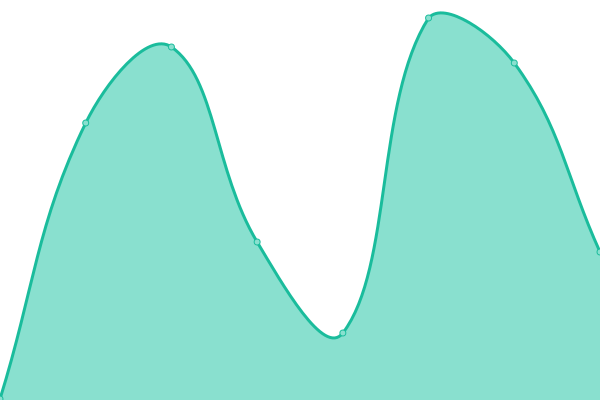
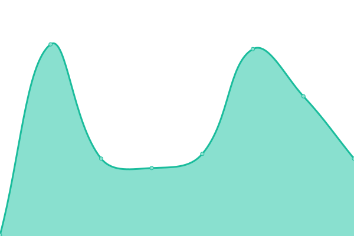

# [📈 Live Status](https://status.minecraftauth.me): <!--live status--> **🟩 All systems operational**

This repository contains the open-source uptime monitor and status page for [MinecraftAuthentication](https://minecraftauth.me), powered by [Upptime](https://github.com/upptime/upptime).

With [Upptime](https://upptime.js.org), you can get your own unlimited and free uptime monitor and status page, powered entirely by a GitHub repository. We use [Issues](https://github.com/MinecraftAuthentication/status/issues) as incident reports, [Actions](https://github.com/MinecraftAuthentication/status/actions) as uptime monitors, and [Pages](https://status.minecraftauth.me) for the status page.

<!--start: status pages-->
<!-- This summary is generated by Upptime (https://github.com/upptime/upptime) -->
<!-- Do not edit this manually, your changes will be overwritten -->
<!-- prettier-ignore -->
| URL | Status | History | Response Time | Uptime |
| --- | ------ | ------- | ------------- | ------ |
|  [Site](https://minecraftauth.me/) | 🟩 Up | [site.yml](https://github.com/MinecraftAuthentication/status/commits/HEAD/history/site.yml) | 

 204ms
     
 | 

<a href="https://status.minecraftauth.me/history/site">100.00%</a>
    

|  Minecraft | 🟩 Up | [minecraft.yml](https://github.com/MinecraftAuthentication/status/commits/HEAD/history/minecraft.yml) | 

 71ms
     
 | 

<a href="https://status.minecraftauth.me/history/minecraft">100.00%</a>
    

|  [Mojang Login](https://authserver.mojang.com/) | 🟩 Up | [mojang-login.yml](https://github.com/MinecraftAuthentication/status/commits/HEAD/history/mojang-login.yml) | 

 161ms
     
 | 

<a href="https://status.minecraftauth.me/history/mojang-login">100.00%</a>
    

|  [Discord API](https://discord.com/api/users/@me) | 🟩 Up | [discord-api.yml](https://github.com/MinecraftAuthentication/status/commits/HEAD/history/discord-api.yml) | 

 99ms
     
 | 

<a href="https://status.minecraftauth.me/history/discord-api">100.00%</a>
    

|  [Patreon API](https://www.patreon.com/api/oauth2/v2/campaigns/0/members) | 🟩 Up | [patreon-api.yml](https://github.com/MinecraftAuthentication/status/commits/HEAD/history/patreon-api.yml) | 

 189ms
     
 | 

<a href="https://status.minecraftauth.me/history/patreon-api">100.00%</a>
    

|  [Twitch Subscriptions API](https://api.twitch.tv/helix/subscriptions) | 🟩 Up | [twitch-subscriptions-api.yml](https://github.com/MinecraftAuthentication/status/commits/HEAD/history/twitch-subscriptions-api.yml) | 

 150ms
     
 | 

<a href="https://status.minecraftauth.me/history/twitch-subscriptions-api">100.00%</a>
    

|  [YouTube Channels API](https://www.googleapis.com/youtube/v3/channels) | 🟩 Up | [you-tube-channels-api.yml](https://github.com/MinecraftAuthentication/status/commits/HEAD/history/you-tube-channels-api.yml) | 

 56ms
     
 | 

<a href="https://status.minecraftauth.me/history/you-tube-channels-api">100.00%</a>
    

|  [Glimpse Sponsorship API](https://api.glimpse.me/auth/access/me) | 🟩 Up | [glimpse-sponsorship-api.yml](https://github.com/MinecraftAuthentication/status/commits/HEAD/history/glimpse-sponsorship-api.yml) | 

 374ms
     
 | 

<a href="https://status.minecraftauth.me/history/glimpse-sponsorship-api">90.61%</a>
    

<!--end: status pages-->

[**Visit our status website →**](https://status.minecraftauth.me)

## 📄 License

- Powered by: [Upptime](https://github.com/upptime/upptime)
- Code: [MIT](./LICENSE) © [MinecraftAuthentication](https://minecraftauth.me)
- Data in the `./history` directory: [Open Database License](https://opendatacommons.org/licenses/odbl/1-0/)
